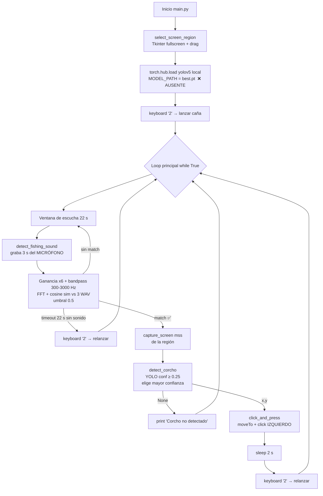

# AUDITORÍA TÉCNICA — IAfishingDetector

> **Etapa 1 (solo lectura).** Bot de pesca para *World of Warcraft Cataclysm 4.3.4* que
> combina YOLOv5 (visión) + FFT de audio (sonido de mordida) + automatización de input.
> Repositorio: `https://github.com/Leo921007/IAfishingDetector.git`
> Auditado el 2026-06-01 sobre el commit `bf392e8` (rama `main`).
> **No se modificó código, no se reentrenó, no se refactorizó nada.**

---

## 1. Resumen ejecutivo

El proyecto es un prototipo funcional **en su máquina original (Windows)** pero **no
ejecutable tal cual**: el código carga el modelo desde `yolov5/runs/train/corcho-detector3/weights/best.pt`,
pero **tanto la carpeta `yolov5/` como el modelo entrenado `best.pt` están ausentes del
repo** (solo se incluye `yolov5s.pt`, los pesos base de COCO que **no** detectan el corcho).
La detección de mordida **no usa visión** (no analiza movimiento del bobber ni el splash):
depende exclusivamente de **comparar 3 s de audio del micrófono** contra 3 WAV de referencia
mediante FFT + similitud coseno. La automatización es **rígida y trivialmente detectable**
(tecla `2` fija, `pyautogui.moveTo` instantáneo, sleeps constantes, sin aleatorización) y
contiene un probable **bug de gameplay**: hace **clic izquierdo** sobre el corcho cuando en
WoW se recoge con **clic derecho**. Las rutas del dataset están **hardcodeadas a Windows**
(`C:/Users/LEONARDO/Desktop/...`). En **WSL2** el bot no corre sin un servidor X, audio de
entrada y privilegios para `keyboard`. Madurez global: **prueba de concepto temprana**.

---

## 2. Diagrama del pipeline

**Flujo textual:**
1. El usuario dibuja manualmente la región de pantalla donde aparecerá el corcho (overlay Tkinter).
2. Se carga el modelo YOLOv5 *custom* desde una ruta local **inexistente** en el repo.
3. Se pulsa `2` para lanzar la caña.
4. Durante 22 s se graba audio del micrófono en ciclos de 3 s; cada ciclo se filtra
   (Butterworth 300–3000 Hz), se calcula su FFT y se compara (coseno) contra `Fishing_1/2/3.wav`.
5. Si la similitud supera 0.5 → se captura la región (`mss`), se corre YOLO, se toma el
   corcho de mayor confianza y se calcula su centro.
6. Se mueve el ratón y se hace **clic izquierdo**; tras 2 s se vuelve a pulsar `2`.
7. Si en 22 s no hubo sonido, se relanza la caña con `2`.

---

## 3. Componentes y archivos

| Archivo | Propósito | Notas |
|---|---|---|
| `main.py` | Orquestador / loop principal end-to-end. | Captura, audio-FFT, YOLO, input. Único ejecutable real del bot. |
| `detect.py` | Script offline: corre YOLO sobre `data/game_screenshots/` y guarda detecciones. | Usa `torch.hub.load('ultralytics/yolov5', ...)` (requiere internet). Herramienta de prueba, no parte del loop. |
| `capturador.py` | Captura de dataset: ROI con OpenCV + 115 screenshots cada 2 s. | Usa `pyautogui.screenshot`. Genera `dataset/images/train`. |
| `sound_validator.py` | Diagnóstico de los WAV de referencia (duración, RMS, silencio). | Utilidad puntual. |
| `normalize_sounds.py` | Normaliza los `.wav` del cwd a un RMS objetivo (3000) → `normalized/`. | Preprocesado de referencias. |
| `compare_fft.py` | Banco de pruebas: graba 3 s y compara FFT (umbral 0.8) con gráficas. | Distinto umbral que `main.py` (0.5). |
| `compare_live_sound.py` | Banco de pruebas: correlación cruzada temporal (umbral 0.15). | Método alternativo no usado por `main.py`. |
| `compare_live_sound_fft.py` | Banco de pruebas: FFT + coseno (umbral 0.55) con gráficas. | Tercer umbral distinto. |
| `train_yolo.py` | Entrenamiento YOLOv5 (100 epochs, imgsz 640, yolov5s.pt). | Apunta a `dataset/fishing.yaml` **que no existe** (el real es `dataset/data.yaml`). |
| `requirements.txt` | `pip freeze` completo (58 deps). | **Codificado en UTF-16** (no UTF-8) → `pip install -r` puede fallar. |
| `dataset/data.yaml` | Config YOLO: `nc: 1`, `names: ['corcho']`. | **Rutas `C:/Users/LEONARDO/Desktop/...` hardcodeadas a Windows.** |
| `yolov5s.pt` | Pesos base COCO (14.1 MB). | **No** es el modelo entrenado; no detecta el corcho. |
| `yolov5/` | Debe contener el repo Ultralytics YOLOv5 + `runs/train/.../best.pt`. | **VACÍA en el repo** → carga del modelo falla. |
| `Fishing_1/2/3.{wav,mp3}` | Sonidos de referencia del splash de pesca. | 3 muestras; base de toda la detección de mordida. |
| `normalized/` | Versiones normalizadas (RMS) de los WAV. | Usadas por los `compare_*`, **no** por `main.py` (este usa los WAV crudos). |
| `data/game_screenshots/` | 7 capturas de juego para pruebas de `detect.py`. | — |
| `dataset/images|labels/` | ~194 train + 20 val, formato YOLO, clase única `corcho`. | Incluye `*.cache`. |

---

## 4. Pipeline end-to-end (detalle solicitado)

**Captura de pantalla / ventana del juego**
- `main.py` → `mss.mss().grab(region)`. No localiza la ventana del juego por título ni handle:
  el usuario **selecciona la región a mano** con un overlay Tkinter (`select_screen_region`).
- `capturador.py` usa `pyautogui.screenshot(region=...)` solo para construir el dataset.
- **No hay** detección de ventana (PyGetWindow está instalado pero no se usa). Todo asume
  coordenadas absolutas de pantalla → frágil a resolución, posición y modo ventana.

**Modelo, pesos y clases**
- Ruta en código: `MODEL_PATH = 'yolov5/runs/train/corcho-detector3/weights/best.pt'`
  (en `detect.py` la ruta equivalente apunta a `corcho-detector3` vía `ultralytics/yolov5`).
- Carga: `torch.hub.load('yolov5', 'custom', path=MODEL_PATH, source='local')`.
- **El `.pt` entrenado no está en el repo** y `yolov5/` está vacía → la carga fallará.
- Clases: **1** (`corcho`). Sin `.onnx` ni exportaciones; inferencia PyTorch pura.
- Umbral de confianza: `0.25` (constante).

**Detección de mordida**
- **Solo por audio.** No se analiza movimiento del bobber, splash visual ni color.
- `detect_fishing_sound`: graba 3 s del **micrófono** (`sounddevice.rec`), aplica ganancia
  x6, filtro Butterworth pasa-banda 300–3000 Hz, FFT (`rfft`), normaliza magnitud y calcula
  **similitud coseno** contra cada `Fishing_*.wav`; match si `> 0.5`.
- Implica que el audio del juego debe salir por altavoces y entrar por micrófono (no hay
  captura por *loopback*).

**Automatización de input**
- Ratón: `pyautogui.moveTo(x,y)` + `pyautogui.click()` → **clic IZQUIERDO** (en WoW el
  corcho se recoge con **clic derecho**: probable bug funcional).
- Teclado: `keyboard.press_and_release('2')` para lanzar/relanzar la caña (keybind `2`
  asumido = hechizo Pesca en la barra de acción).
- Loot: depende del **autoloot** del juego (no hay lógica de loot explícita).
- Resolución asumida: la de la región seleccionada; sin normalización ni escalado UI.

**Loop, umbrales, timings y máquina de estados**
- Estados implícitos: `LANZAR(2)` → `ESCUCHAR(≤22 s)` → `LOCALIZAR(YOLO)` → `RECOGER(click)` → `RELANZAR(2)`.
- Timings: ventana de escucha 22 s; grabación 3 s/ciclo; `time.sleep(0.5)` entre ciclos;
  `DELAY_AFTER_CLICK = 2 s`; `sleep(1)` tras el primer lanzamiento.
- Umbrales: confianza YOLO 0.25; similitud audio 0.5 (en `main.py`).

**Manejo de errores / recuperación**
- Solo se captura `KeyboardInterrupt`. No hay try/except sobre carga de modelo, audio,
  captura ni inferencia.
- Corcho no detectado → solo imprime y continúa (la caña queda lanzada, sin reintento explícito).
- No detecta **línea rota**, **fallo de loot**, ni **falsos positivos** de sonido.
- Sin reintentos, backoff ni watchdog.

**Humanización / anti-detección**
- **Inexistente.** Movimiento instantáneo (`moveTo` sin duración ni curva), clics sin jitter,
  misma tecla siempre, sleeps fijos, sin pausas/descansos aleatorios. Patrón altamente
  detectable por heurísticas anti-bot.

**Logging y configuración**
- Solo `print()` con emojis; sin `logging`, sin niveles, sin fichero de log.
- Configuración por **constantes globales** dispersas; sin archivo de config ni CLI.
- Inconsistencia de umbrales de audio entre scripts: 0.5 / 0.55 / 0.8 / 0.15.

---

## 5. Inventario de dependencias y riesgos de entorno (WSL2)

**Entorno local detectado:** WSL2 (Linux 6.6, Ubuntu), `git 2.43.0`, `python 3.12.3`,
**`pip` NO instalado**. `requirements.txt` fija `torch==2.6.0` (CPU/CUDA), `numpy==2.1.1`.

| Dependencia (versión fija) | Uso | Riesgo en WSL2 |
|---|---|---|
| `torch==2.6.0`, `torchvision==0.21.0`, `torchaudio==2.6.0` | Inferencia YOLOv5 | 🟠 Sin GPU/CUDA en WSL2 por defecto → CPU lento; descarga pesada. |
| `ultralytics==8.3.108` | Backend YOLO | 🟡 OK, pero el código usa el repo clásico `yolov5/` (ausente). |
| `opencv-python==4.11.0.86` | Conversión de color / ROI | 🟠 `cv2.selectROI`/`imshow` necesitan **servidor X** (GUI). |
| `mss==10.0.0` | Captura de pantalla | 🔴 Requiere display X; en WSL2 headless captura un escritorio vacío/inexistente. |
| `pyautogui==0.9.54` (+ PyScreeze, PyTweening, PyGetWindow, MouseInfo) | Ratón/teclado/screenshot | 🔴 Necesita X y `Xlib`/`scrot`; mueve el cursor del host X, no del juego Windows. |
| `keyboard==0.13.5` | Pulsar tecla `2` | 🔴 En Linux requiere **root** (acceso a `/dev/input`); no inyecta al WoW de Windows. |
| `sounddevice==0.5.1` (PortAudio) | Grabar micrófono | 🔴 WSL2 normalmente **sin dispositivo de entrada**; PortAudio fallará. |
| `pydub==0.25.1` | Cargar WAV/MP3 | 🟠 Necesita **ffmpeg** instalado (no listado). |
| `scipy==1.15.2` | Butterworth, FFT, correlate | 🟢 OK. |
| `matplotlib==3.10.1`, `seaborn` | Gráficas en `compare_*` | 🟠 `plt.show()` necesita backend GUI (X). |
| `tkinter` (stdlib) | Overlay de selección de región | 🔴 Requiere X y `python3-tk`. |
| `numpy==2.1.1` | Núcleo numérico | 🟡 NumPy 2.x puede chocar con ruedas antiguas de torch/cv2. |
| `pandas`, `GitPython`, `requests`, `tqdm`, etc. | Transitivas de Ultralytics | 🟢 OK. |

**Veredicto WSL2:** el bot está diseñado para **Windows con el juego en primer plano**.
En WSL2 "puro" (sin WSLg/X ni audio) **no puede capturar pantalla, inyectar input ni grabar
sonido del juego de Windows**. WSL2 sirve para **reentrenar el modelo y procesar audio/visión
offline**, no para operar el bot en vivo. Falta documentar y, sobre todo, falta **instalar pip**.

---

## 6. Debilidades priorizadas por severidad

### 🔴 Crítico
- **C1 — Modelo entrenado ausente.** `best.pt` y la carpeta `yolov5/` no están en el repo;
  el único `.pt` es COCO base. El bot **no detecta el corcho** y la carga de modelo falla.
- **C2 — Detección de mordida solo por micrófono.** Depende de captar el audio del juego por
  el micrófono físico; sensible a volumen, ruido ambiente, otros sonidos del juego y del SO.
  Sin *loopback* del audio del juego → falsos negativos masivos en condiciones reales.
- **C3 — Clic izquierdo en vez de derecho.** En WoW el corcho se recoge con **clic derecho**;
  `pyautogui.click()` usa izquierdo → probable fallo de recogida en todas las capturas.
- **C4 — Inoperable en WSL2 en vivo.** Captura/input/audio dependen de Windows + X + root
  (ver §5). Riesgo de entorno bloqueante para la operación.

### 🟠 Alto
- **A1 — Ventana de mordida de Cata 4.3.4 frágil.** Latencia acumulada (3 s grabación + FFT +
  captura + inferencia + `moveTo`) puede **exceder la ventana de bite** (~pocos segundos),
  perdiendo la mordida. Procesar después de 3 s ya parte tarde.
- **A2 — Dependencia total de resolución/posición/UI scale.** Coordenadas absolutas, región
  manual, sin localizar la ventana ni normalizar por escala de UI → se rompe al mover/redimensionar.
- **A3 — Dataset pobre y poco diverso.** ~194 imágenes de **una sola zona/sesión** (capturas
  del 12/04, misma agua/clima/hora) y clase única → mala generalización entre zonas, clima,
  día/noche, profundidad de agua y lures.
- **A4 — Sin humanización → detectable.** Movimiento instantáneo, tecla fija, sleeps constantes,
  sin descansos: patrón mecánico fácil de marcar por anti-cheat/heurística.
- **A5 — `requirements.txt` en UTF-16.** `pip install -r` puede fallar a parsear; reproducibilidad
  comprometida.

### 🟡 Medio
- **M1 — Umbrales de audio inconsistentes** entre scripts (0.5/0.55/0.8/0.15) y solo 3 muestras
  de referencia → frágil ante falsos positivos/negativos; sin validación estadística.
- **M2 — Rutas hardcodeadas a Windows** en `dataset/data.yaml` (`C:/Users/...`) → entrenamiento
  no portable.
- **M3 — `train_yolo.py` apunta a `dataset/fishing.yaml` inexistente** (debería ser `data.yaml`).
- **M4 — Manejo de errores casi nulo.** Sin recuperación ante línea rota, loot fallido, modelo
  no cargado o sin dispositivo de audio.
- **M5 — Latencia de inferencia en CPU.** Sin GPU, YOLOv5s en CPU añade cientos de ms por frame,
  agravando A1.

### 🟢 Bajo
- **B1 — Sin logging estructurado ni configuración centralizada** (solo `print`, constantes dispersas).
- **B2 — Código duplicado** en los tres `compare_*` y funciones de audio repetidas en `main.py`.
- **B3 — `normalized/` vs WAV crudos:** `main.py` compara contra los crudos; los `compare_*`
  contra los normalizados → criterio incoherente.
- **B4 — Lógica de relanzado tras "corcho no detectado"** no reintenta de forma explícita
  (puede esperar 22 s ociosos).

---

## 7. Roadmap de mejoras por etapas (propuesta — sin implementar)

> Solo títulos y justificación. La implementación queda sujeta a tu aprobación.

- **Etapa 2 — Reproducibilidad y entorno.**
  *Por qué:* sin pip, con `requirements.txt` en UTF-16 y rutas Windows, nada arranca de forma
  fiable. Definir entorno (venv/conda), `requirements` UTF-8 saneado, ffmpeg, y separar claramente
  "modo entrenamiento (WSL2/Linux)" de "modo operación (Windows)".

- **Etapa 3 — Recuperar/regenerar el modelo y el dataset.**
  *Por qué:* el bot no detecta el corcho sin `best.pt`. Versionar/obtener el modelo entrenado,
  ampliar y diversificar el dataset (zonas, clima, día/noche, lures) y documentar el pipeline de
  entrenamiento reproducible.

- **Etapa 4 — Detección de mordida robusta (visión + audio).**
  *Por qué:* C2/A1. Sustituir/duplicar el audio por **detección visual del splash/movimiento del
  bobber** (diff de frames sobre el ROI del corcho) y capturar el audio del juego por *loopback*
  en vez de micrófono; fusionar señales para reducir falsos pos/neg.

- **Etapa 5 — Corrección de gameplay y timings de Cata 4.3.4.**
  *Por qué:* C3/A1. Clic **derecho** para recoger, calibrar la ventana de bite, reducir latencia
  (inferencia ligera, captura incremental) y ajustar a autoloot/lures.

- **Etapa 6 — Localización de ventana e independencia de resolución.**
  *Por qué:* A2. Detectar la ventana de WoW (título/handle), trabajar en coordenadas relativas y
  normalizar por escala de UI para no depender de una región dibujada a mano.

- **Etapa 7 — Robustez, máquina de estados y recuperación.**
  *Por qué:* M4. FSM explícita con manejo de línea rota, loot fallido, reintentos con backoff,
  watchdog y *fail-safes*.

- **Etapa 8 — Humanización / anti-detección.**
  *Por qué:* A4. Movimiento del ratón con curvas y duración variable, jitter, retardos
  aleatorizados, pausas/descansos y variación de cadencia para evitar patrones mecánicos.

- **Etapa 9 — Observabilidad y configuración.**
  *Por qué:* B1. `logging` estructurado, archivo de configuración/CLI único, métricas de
  capturas/éxito y depuración guiada por datos.

- **Etapa 10 — Calidad de código y pruebas.**
  *Por qué:* B2/B3. Unificar utilidades de audio, eliminar duplicación de los `compare_*`,
  añadir tests sobre los componentes deterministas (FFT, parsing, geometría de bbox).

---

## 8. Datos del repositorio

- **Commit auditado:** `bf392e8` — "Versión final del README.md".
- **Historial (5 commits):** `8f96d57` Versión 1.0 → `4f8e238` requirements → `00ba8a6`/`6abbcc4`/`bf392e8` README.
- **Ramas:** `main` (única; `origin/HEAD → origin/main`). Sin submódulos (`.gitmodules` ausente).
- **Tamaño:** ~40 MB con `.git`, ~22 MB de árbol de trabajo. Mayor artefacto: `yolov5s.pt` (14.1 MB).
- **Licencia:** README menciona MIT; **no hay** fichero `LICENSE`.

---

*Fin de la Etapa 1. A la espera de aprobación para iniciar la Etapa 2. No se ha modificado*
*ningún archivo del proyecto salvo la creación de este documento (`AUDITORIA.md`).*
